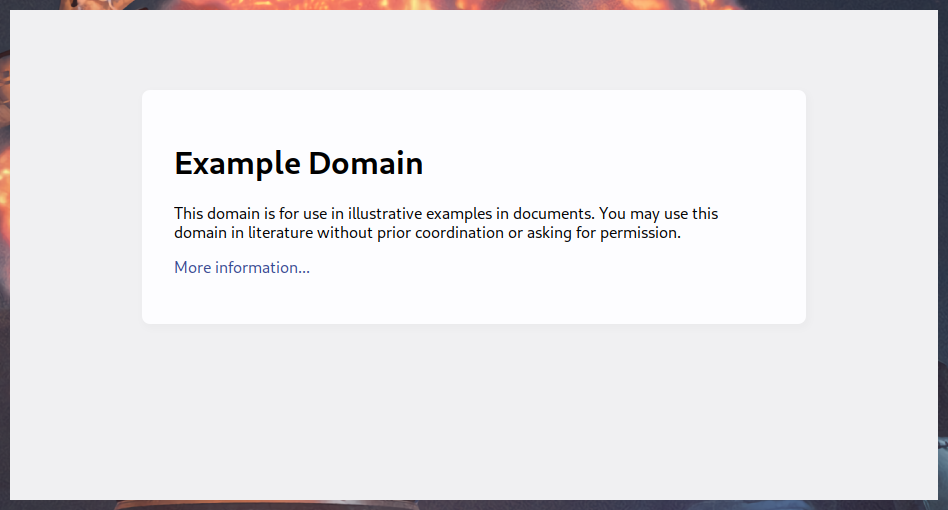

# rism

rism is a minimalistic single-page browser based on tauri, using your platform's native webview.  
It accepts some CLI arguments and displays a web page, that's about it. You can use it to window-ify any website, allowing it to live outside your browser. rism also supports setting a custom title, which allows it to easily be matched by window managers.

This project is considered feature-complete.

## Features

- Displays a website
- Smallish binary
- Pure CLI configuration

# Installation

Binaries are available for the following x86-64 platforms:
| Platform | | |
| --- | --- | --- |
| Arch | [AUR][arch-aur] | |
| Debian | [Package][debian-deb] | |
| Linux | [Appimage][linux-appimage] | |
| Windows | [Portable][windows-exe] | [Installer][windows-msi] |

[arch-aur]: https://aur.archlinux.org/packages/rism-bin
[debian-deb]: https://github.com/thorio/rism/releases/latest/download/rism-x86_64.deb
[linux-appimage]: https://github.com/thorio/rism/releases/latest/download/rism-x86_64.AppImage
[windows-exe]: https://github.com/thorio/rism/releases/latest/download/rism-x86_64.exe
[windows-msi]: https://github.com/thorio/rism/releases/latest/download/rism-x86_64.msi

Basic usage: `rism https://example.com`  
See also: `rism --help`.

# Development

Using the devcontainer is highly encouraged to get up and running ASAP, otherwise:

- [Install Rust][rustup]
- Follow the [tauri prerequisites guide][tauri-setup]
- Use the [tauri CLI][tauri-cli]

[rustup]: https://www.rust-lang.org/tools/install
[tauri-setup]: https://tauri.app/v1/guides/getting-started/prerequisites
[tauri-cli]: https://tauri.app/v1/api/cli/
